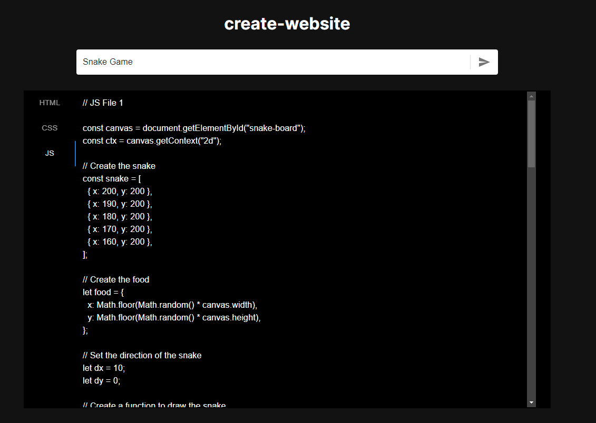
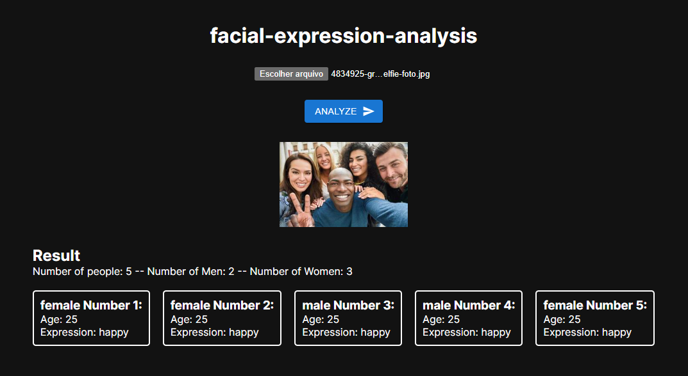
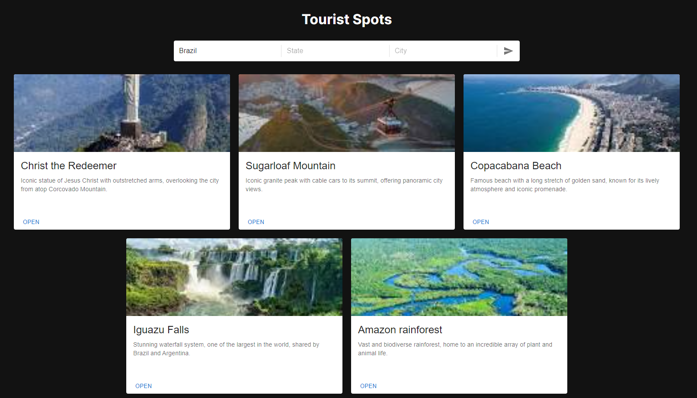
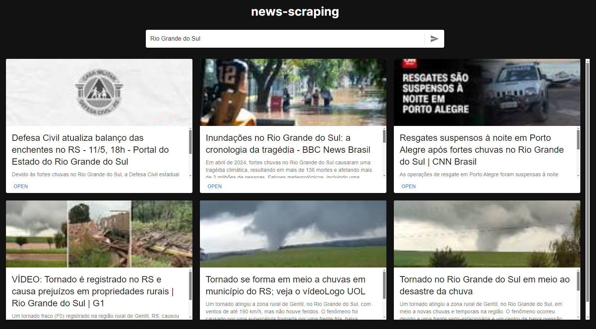

# AI-Mastermind

This AI-Mastermind project is a Next.js application that offers four distinct functionalities:

1. **Creation of Basic Website on Any Theme and Subject**: Generates the necessary files to create a basic website on any theme and subject.



2. **Image Analysis**: Analyzes images and returns information such as the number of people, the number of men and women, estimated age of each person, and facial expression of each.



3. **Tourist Spot Exploration**: Takes a location in the world as input and returns the main tourist spots of that location, along with a summary and a link to the location on Google Maps.



4. **News Search**: Conducts a search for the latest news on a particular topic, returning a list of news items with a summary and a link to each one.



## Requirements

Before running the project, you need to have the following installed:

- Node.js (v14.0.0 or higher)
- npm (v6.14.0 or higher) or Yarn (v1.22.0 or higher)

## .env File Configuration

To ensure the image analysis functionality works correctly, you need to set up the Gemini API key. Add the following line to your `.env` file:

NEXT_PUBLIC_API_KEY=YourGeminiKeyHere

Make sure to replace `YourGeminiKeyHere` with your Gemini API key.

## How to Run

After cloning the repository, navigate to the project's root folder and execute the following commands in the terminal:

```bash
npm install
# or
yarn install
```

After installing the dependencies, you can start the development server with the following command:

```bash
npm run dev
# or
yarn dev
```

This will start the Next.js development server. You can access the application at http://localhost:3000 in your browser to see the result.

## Links

- **GitHub:** [AI-Mastermind](https://github.com/Luiz-Cunha-Dev/ai-mastermind)
- **Perfil do GitHub:** [Luiz-Cunha-Dev](https://github.com/Luiz-Cunha-Dev)
- **Perfil do LinkedIn:** [Luiz Miguel da Cunha](https://www.linkedin.com/in/luizmcunha/)